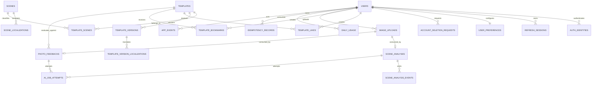

# DearShot 데이터 모델

이 문서는 Android 로컬 데이터와 서버 PostgreSQL 데이터의 경계를 정의합니다. 서버는 템플릿과 계정처럼 유지해야 하는 데이터만 영구 보관하고, 분석용 이미지와 AI 결과에는 짧은 보존 기간을 적용합니다.

## 설계 원칙

- 서버 DB는 PostgreSQL, 애플리케이션 스키마와 migration은 Drizzle로 관리합니다.
- 기본 키는 UUID, 시각은 UTC `timestamptz`, DB 이름은 `snake_case`를 사용합니다.
- 소셜 로그인 토큰과 refresh token 원문은 저장하지 않습니다.
- 촬영 원본과 사용자의 갤러리는 서버에 영구 보관하지 않습니다.
- 배포된 템플릿 버전은 수정하지 않고 새 버전을 생성합니다.
- 관계와 권한은 FK와 unique constraint로 보호하고, 조회하지 않는 가변 결과만 JSONB로 저장합니다.
- 일반 서버 로그, 도메인 작업 상태, 제품 분석 이벤트를 서로 분리합니다.

## 데이터 경계

| 데이터 | Android | 서버 | 기본 보존 기간 |
| --- | --- | --- | --- |
| 촬영 원본·갤러리 URI | 영구 또는 사용자 삭제 시까지 | 저장하지 않음 | 사용자 선택 |
| 촬영 세션·선택 사진 | Room | 저장하지 않음 | 사용자 선택 |
| 템플릿 캐시 | Room | PostgreSQL + 정적 자산 | 버전별 영구 |
| 분석용 압축 이미지 | 임시 파일 | EC2 임시 파일 | 처리 직후, 최대 1시간 |
| 장면 분석·피드백 결과 | 세션에 필요한 범위 | PostgreSQL | 7일 |
| SSE 이벤트 | 필요 시 마지막 ID | PostgreSQL | 24시간 |
| AI 요청 시도 이력 | 저장하지 않음 | PostgreSQL | 30일 |
| 제품 이벤트 | 저장하지 않음 | PostgreSQL | 원본 90일 |

## 서버 ERD



## 계정과 인증

### `users`

게스트와 회원을 동일한 principal로 다룹니다.

| 필드 | 타입·제약 | 설명 |
| --- | --- | --- |
| `id` | UUID PK | 서버 사용자 ID |
| `account_type` | `GUEST`, `MEMBER` | 계정 유형 |
| `role` | `USER`, `ADMIN` | 권한 |
| `status` | `ACTIVE`, `DELETION_PENDING`, `DELETED` | 계정 상태 |
| `display_name` | varchar, nullable | 회원 표시 이름 |
| `profile_image_url` | text, nullable | 회원 프로필 이미지 |
| `created_at`, `updated_at` | timestamptz | 생성·수정 시각 |
| `deleted_at` | timestamptz, nullable | 탈퇴 처리 시각 |

게스트가 Google 또는 Kakao 로그인에 성공하면 트랜잭션 안에서 기존 `users` 행에 identity를 연결하고 `account_type`을 `MEMBER`로 변경합니다. 이미 다른 회원이 사용하는 identity라면 자동 병합하지 않고 기존 회원으로 로그인한 뒤 게스트 데이터를 정리합니다.

### `auth_identities`

| 필드 | 설명 |
| --- | --- |
| `id` | UUID PK |
| `user_id` | `users.id` FK |
| `provider` | `GOOGLE`, `KAKAO` |
| `provider_subject` | 검증된 Google `sub` 또는 Kakao 사용자 ID |
| `created_at` | 연결 시각 |

`UNIQUE(provider, provider_subject)`를 적용합니다. OAuth access token과 ID token 원문은 보관하지 않습니다.

### `refresh_sessions`

`user_id`, `installation_id`, `token_hash`, `token_family_id`, `expires_at`, `revoked_at`, `replaced_by_id`, `last_used_at`을 저장합니다. Refresh token은 SHA-256 해시만 저장하고 회전된 token family 재사용을 감지하면 해당 family를 모두 폐기합니다.

### `user_preferences`

`user_id`를 PK/FK로 사용하고 `locale`, `default_aspect_ratio`, `allow_location_context`, `ai_processing_consent_version`, `updated_at`을 저장합니다.

### `account_deletion_requests`

API가 반환할 `deletion_id`, `user_id`, `status`, `reason`, `requested_at`, `scheduled_at`, `completed_at`을 저장합니다. 완료 후에는 사용자와 연결된 데이터가 삭제되었는지 검증합니다.

## 장면과 템플릿

### `scenes`, `scene_localizations`

`scenes.key`는 `beach`, `cafe`, `night-city` 같은 안정적인 문자열 PK입니다. 노출 상태, 썸네일 자산 경로, 정렬 순서를 가집니다. 표시 이름은 `(scene_key, locale)` 복합 PK를 사용하는 `scene_localizations`에 분리합니다.

### `templates`, `template_scenes`

`templates.id`는 `beach-breeze` 같은 안정적인 slug입니다. `status`, `people_count`, `supported_aspect_ratios`, `current_version`, `like_count`, 생성·수정 시각을 저장합니다. 하나의 템플릿이 여러 장면에 노출될 수 있으므로 `template_scenes`는 `(template_id, scene_key)` 복합 PK를 사용합니다.

### `template_versions`

| 필드 | 설명 |
| --- | --- |
| `template_id`, `version` | 복합 PK |
| `status` | `DRAFT`, `PUBLISHED`, `ARCHIVED` |
| `preview_path`, `thumbnail_path` | 버전 고정 정적 자산 |
| `guide_type`, `guide_asset_path` | SVG 또는 raster 가이드 |
| `guide_config` | 정규화 좌표, reference size, safe area JSONB |
| `created_at`, `published_at` | 생성·배포 시각 |

`PUBLISHED` 상태의 행은 수정하지 않습니다. 템플릿 수정은 새 version을 추가하고 `templates.current_version`을 원자적으로 교체합니다.

### `template_version_localizations`

`(template_id, version, locale)` 복합 PK와 `title`, `summary`, `instructions JSONB`를 사용합니다. instructions는 항상 한 묶음으로 읽고 독립 검색하지 않으므로 JSONB를 허용합니다.

### `template_likes`, `template_bookmarks`

두 테이블 모두 `(user_id, template_id)` 복합 PK를 사용합니다. 좋아요 설정·해제는 트랜잭션 안에서 `templates.like_count`와 함께 갱신하며 count가 음수가 되지 않도록 check constraint를 둡니다.

## 이미지와 AI 작업

### `image_uploads`

이미지는 DB에 넣지 않고 EC2 임시 파일의 메타데이터만 저장합니다.

| 필드 | 설명 |
| --- | --- |
| `id` | UUID PK |
| `owner_user_id` | 회원 또는 게스트 |
| `purpose` | `SCENE_ANALYSIS`, `PHOTO_FEEDBACK` |
| `storage_path` | 외부에 노출하지 않는 상대 경로 |
| `content_type`, `byte_size`, `sha256` | 검증된 파일 정보 |
| `status` | `READY`, `CONSUMED`, `DELETED`, `EXPIRED` |
| `expires_at`, `consumed_at`, `deleted_at` | 파일 수명주기 |

하나의 업로드는 하나의 AI 작업에서만 소비합니다. DB 상태 변경과 작업 생성을 한 트랜잭션으로 처리합니다.

### `scene_analyses`

사용자, 업로드, 상태, 실제 처리 단계, 진행률, locale, 촬영 시각, provider/model, 실패 코드, 재시도 가능 여부와 생성·완료·만료 시각을 저장합니다. 정확한 위치가 필요한 경우 작업 중에만 nullable 컬럼으로 보유하고 완료 후 제거합니다. UI에 반환하는 clues, candidates, recommendation은 독립 검색 대상이 아니므로 검증된 `result JSONB`로 저장합니다.

### `scene_analysis_events`

`id bigint`, `analysis_id`, `event_type`, `payload JSONB`, `created_at`, `expires_at`을 가집니다. bigint ID를 SSE event ID로 사용해 Android의 `Last-Event-ID` 재연결을 지원합니다.

### `photo_feedbacks`

사용자와 업로드, 선택한 `(template_id, template_version)`, 선택적인 `analysis_id`, `previous_feedback_id`, capture metadata, 상태, 검증된 결과 JSONB, provider/model, 실패 정보와 만료 시각을 저장합니다. 템플릿 버전에는 복합 FK를 적용합니다.

### `ai_job_attempts`

최종 작업 상태와 provider 호출 시도를 분리합니다.

| 필드 | 설명 |
| --- | --- |
| `scene_analysis_id`, `photo_feedback_id` | 둘 중 정확히 하나만 설정 |
| `attempt_number` | 작업별 1부터 증가 |
| `provider`, `model` | 호출 대상 |
| `prompt_version`, `schema_version` | 재현 가능한 계약 버전 |
| `status` | `SUCCEEDED`, `FAILED` |
| `failure_phase`, `error_code`, `provider_status_code` | 표준화된 실패 정보 |
| `retryable`, `latency_ms` | 재시도와 성능 판단 |
| `input_tokens`, `output_tokens` | 사용량 추적 |
| `request_id`, `started_at`, `completed_at` | 요청 추적 |

`num_nonnulls(scene_analysis_id, photo_feedback_id) = 1` check constraint를 둡니다. 원본 프롬프트, 이미지, provider 원본 응답은 저장하지 않습니다.

## 비용과 제품 분석

### `daily_usage`

`(user_id, usage_date)` 복합 PK와 `scene_analysis_count`, `photo_feedback_count`, `updated_at`을 사용합니다. AI 작업 생성과 사용량 증가는 같은 트랜잭션에서 처리합니다.

### `idempotency_records`

`(user_id, scope, idempotency_key)` unique constraint와 `request_hash`, 응답 상태·본문, 만료 시각을 저장합니다. Android 재시도로 동일한 AI 비용이 두 번 발생하지 않게 합니다.

### `app_events`

게스트와 회원의 핵심 제품 흐름만 기록합니다.

| 필드 | 설명 |
| --- | --- |
| `id` | bigint PK |
| `actor_id`, `actor_type` | 게스트 또는 회원 principal |
| `session_id` | 앱 사용 세션 |
| `event_name` | 허용 목록에 있는 이벤트 |
| `app_version`, `os_version`, `locale` | 오류·전환 분석용 차원 |
| `properties` | 이벤트별 schema가 제한된 JSONB |
| `request_id`, `occurred_at` | 서버 작업과 연결 |

초기 이벤트는 `scene_analysis_requested/completed/failed`, `template_selected`, `capture_completed`, `feedback_requested/completed/failed`, `retake_started`, `photo_saved`, `login_prompt_shown/completed`로 제한합니다. 카메라 프레임과 모든 터치는 기록하지 않습니다.

일반 request log와 stack trace는 PostgreSQL이 아니라 Pino JSON 로그와 Docker log rotation으로 관리합니다. DB 장애도 관찰할 수 있도록 로그 저장소를 DB에 의존시키지 않습니다.

## 오류 분류

외부 provider 메시지를 그대로 노출하거나 저장하지 않고 내부 코드로 변환합니다.

```text
INVALID_IMAGE
IMAGE_TOO_LARGE
UPLOAD_EXPIRED
UPLOAD_NOT_FOUND
PROVIDER_TIMEOUT
PROVIDER_RATE_LIMIT
PROVIDER_UNAVAILABLE
PROVIDER_INVALID_RESPONSE
PROVIDER_SAFETY_BLOCKED
AI_RESPONSE_PARSE_FAILED
NO_SCENE_MATCH
TEMPLATE_NOT_FOUND
CANCELLED_BY_USER
INTERNAL_ERROR
```

## 필수 인덱스

```text
auth_identities(provider, provider_subject) UNIQUE
refresh_sessions(token_hash) UNIQUE
refresh_sessions(user_id, expires_at)
templates(status, current_version)
template_scenes(scene_key, template_id)
template_likes(template_id, created_at)
template_bookmarks(user_id, created_at)
image_uploads(owner_user_id, status)
image_uploads(expires_at)
scene_analyses(user_id, created_at DESC)
scene_analyses(status, created_at)
scene_analysis_events(analysis_id, id)
photo_feedbacks(user_id, created_at DESC)
photo_feedbacks(status, created_at)
ai_job_attempts(scene_analysis_id, attempt_number)
ai_job_attempts(photo_feedback_id, attempt_number)
app_events(event_name, occurred_at)
app_events(actor_id, occurred_at DESC)
idempotency_records(user_id, scope, idempotency_key) UNIQUE
```

## 삭제와 보존 작업

- 서버의 주기 작업이 만료된 이미지, SSE 이벤트, AI 결과를 정리합니다.
- 회원 탈퇴 시작 시 refresh session을 즉시 폐기하고 진행 중 작업을 취소합니다.
- 좋아요·북마크·preferences·identity는 사용자 삭제에 맞춰 cascade합니다.
- 사용자와 연결된 원본 제품 이벤트는 삭제하거나 actor를 제거한 집계치로만 남깁니다.
- `app_events`는 90일 뒤 원본을 삭제하며 장기 지표가 필요하면 일별 집계만 남깁니다.
- 백업에도 동일한 만료 정책이 반영되도록 백업 보존 기간을 문서화합니다.

## Android Room

### `capture_sessions`

세션 UUID, 상태, 분석 결과 ID, 선택한 scene, 현재 template ID/version, 생성·수정 시각을 저장합니다.

### `captured_photos`

사진 UUID, 세션 ID, 촬영 당시 template ID/version, 앱 전용 `local_uri`, feedback 상태·ID, 선택 여부, 최종 `media_store_uri`를 저장합니다.

### `cached_templates`

template ID/version/locale을 키로 서버 응답과 자산 경로, cache expiry를 저장합니다. 서버가 새 버전을 배포해도 진행 중인 촬영은 기존 버전을 유지합니다.

## Migration 순서

1. PostgreSQL과 Drizzle migration 기반
2. 사용자·identity·refresh session·preferences
3. scene·template·version·localization
4. like·bookmark
5. image upload
6. usage·idempotency
7. scene analysis·SSE event
8. AI attempt·photo feedback
9. app event·retention job

각 기능 PR이 자기 테이블과 migration을 추가합니다. 초기 PR에서 모든 테이블을 한꺼번에 생성하지 않습니다.
